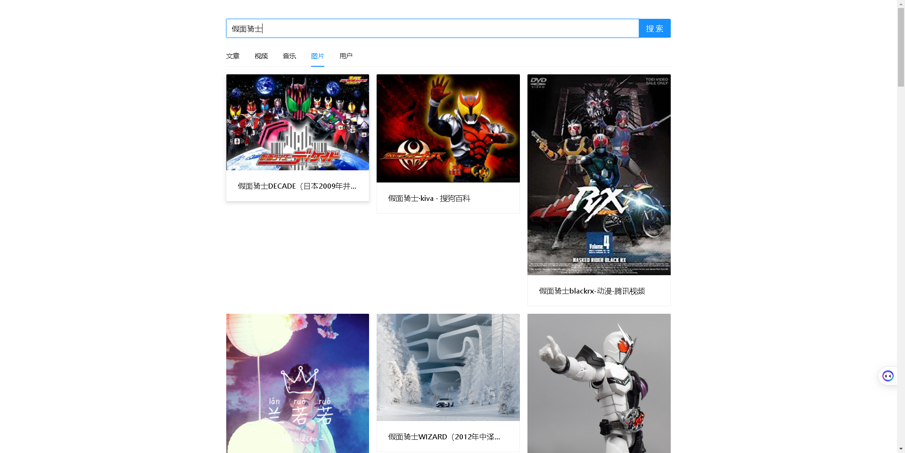

## Faiz 聚合搜索平台 🌈
>基于Spring Boot + Elastic Stack + Vue3的一站式信息聚合搜索平台，用户可在同一页面集中搜索出不同来源、不同类型的内容，提升搜索体验。
> 
> 在线访问：http://search.tempeisite.xyz
---
## 技术栈
- Spring Boot
- MP
- MySQL
- Elasticsearch
- Jsoup爬虫
- Canal
- JMeter压力测试
---
## 架构图

---
## 项目亮点

- 使用 HttpClient **定期**请求获取掘金网站的文章，并使用 Hutool 的 JSONUtil 解析和预处理文章，最终存入 MySQL。
- 使用 jsoup **实时**请求 bing 搜索接口获取图片，并使用 CSS Selector 语法解析和预处理图片信息，最终返回前端。
- 为提高聚合搜索接口的通用性，首先通过**定义数据源接口来实现统一的数据源接入标准**；当新数据源（比如视频）要接入时，只需使用**适配器模式**对其数据查询接口进行封装、以适配数据源接口，无需修改原有代码，提高了系统的可扩展性。
- 为解决文章搜不出的问题，**自主搭建 ElasticSearch 来代替 MySQL 的模糊查询**，并通过为索引绑定 ik 分词器实现了更灵活的分词搜索，且使用 JMeter 测试后发现**搜索性能提升了 65.60%**。
- 开发搜索功能时，使用 Kibana DevTools + DSL 调试 ElasticSearch 的搜索效果，并使用Spring Data ElasticSearch 的 QueryBuild 组合查询条件，实现对文章的灵活查询。
- 为优化搜索结果的展示，提升用户体验，使用 ElasticSearch 的 HighLight 语法实现**前端搜索关键词的高亮展示**。
- 使用 Canal 实现了 MySQL 文章数据向 ElasticSearch 的自动同步，结合**动静分离策略**，在实现高性能的同时，保证 ElasticSearch 中数据的精确性。
---
## 项目展示
前端有时候切换tab好像有点毛病，算了不管了，刷新页面就可以。

